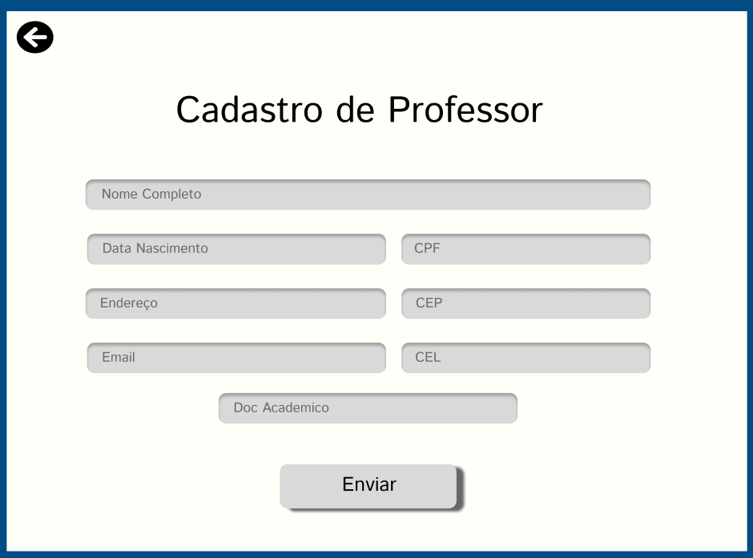

# Requisitos: 

Descreveremos 5 cenários de caso de uso: cadastro de Aluno, de Fornecedor, Pessoa Física, Professor e Pessoa Jurídica. Todos cenarios tem as seguintes pré e pós condições:

*Pré-condições:*

•	O usuário deve estar logado no sistema para realizar o cadastro;

•	O CPF informado deve ser válido e único (não duplicado no sistema);

•	O sistema deve estar conectado ao banco de dados para armazenar as informações.

*Pós-condições:*

•	Se o cadastro for bem-sucedido, o sistema deverá armazenar todas as informações fornecidas, e a informação cadastrada deve estar registrada no banco de dados;

•	O usuário será informado do sucesso da operação e poderá visualizar as informações cadastradas.

# Prototipação:

# Modelo de Entidade e Relacionamento

# Caso de uso com UML

